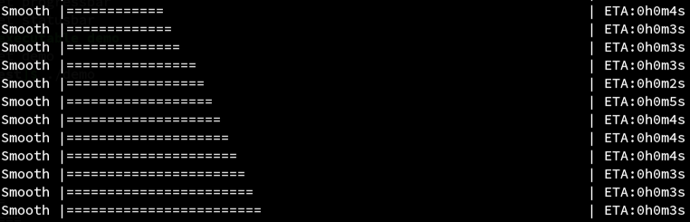

## Intro

Progress bar is a small module written in [vlang](https://github.com/vlang/v) to create progress bar on cli. It's a port of [doches/progressbar](https://github.com/doches/progressbar). It aims to provide complete functionality of the original project.

Currently only progress bar has been implemented and nothing is being exported.



## Building

First clone the repo

```
https://github.com/Waqar144/progressbar.git
```

Then

```
v run progressbar.v
```

## Contributing

Feel free to clone and contribute. All contributions are welcome.

## License

MIT
